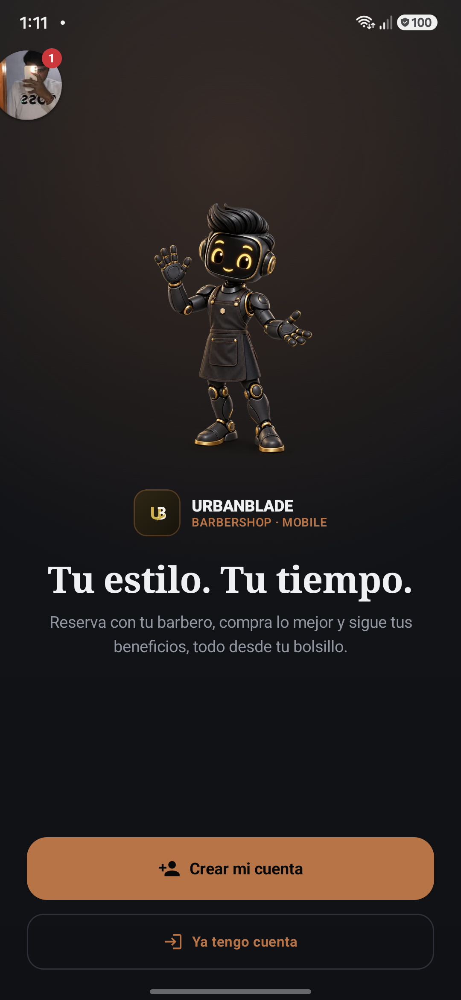
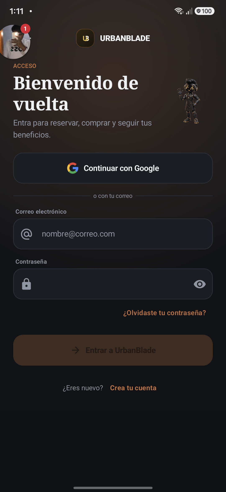
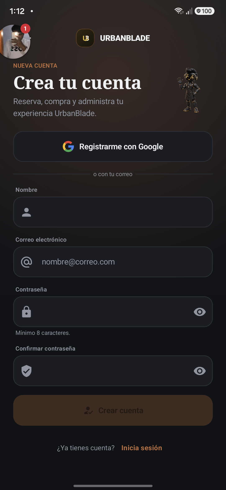
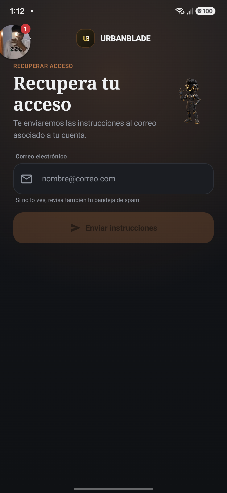
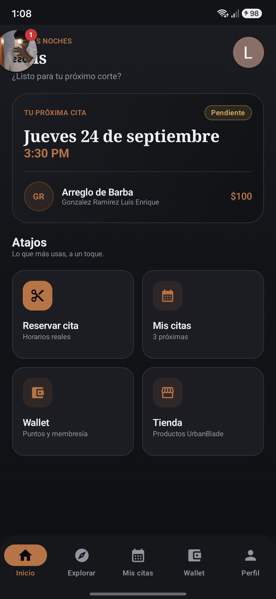
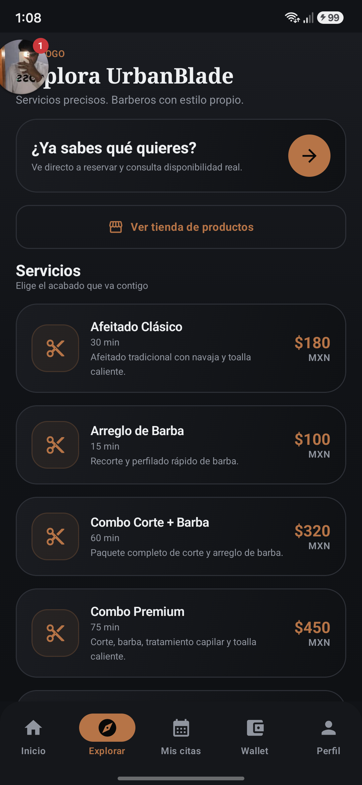
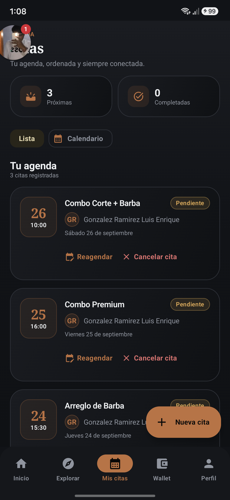
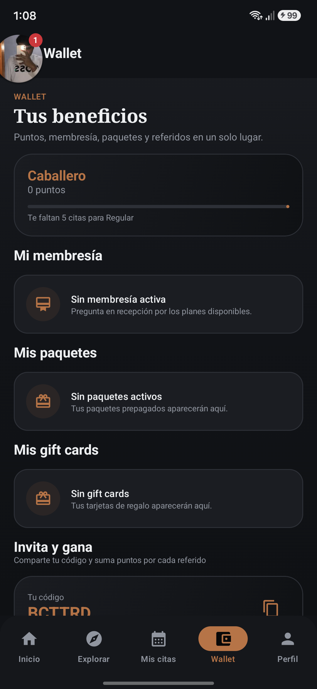
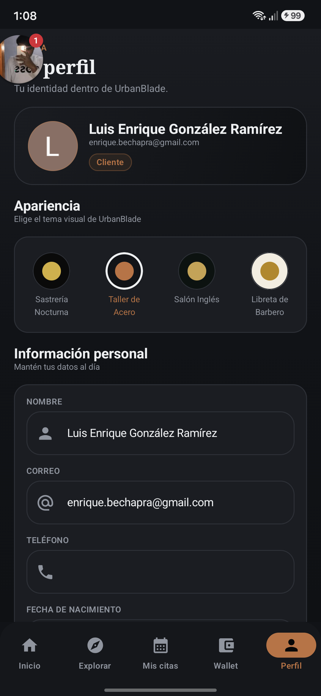
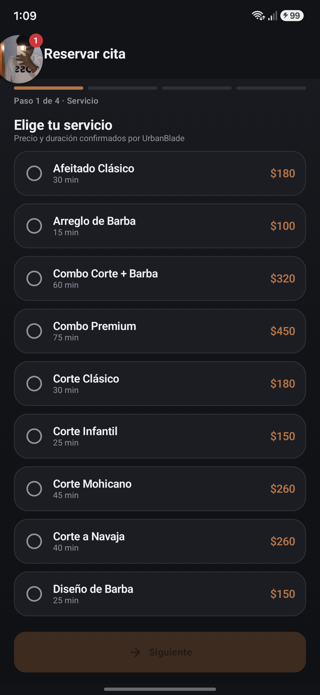

# Auditoría UI/UX — UrbanBladeMobile

Fecha: 24 de septiembre de 2026  
Dispositivo observado: Samsung, 1080 × 2340 px, densidad efectiva 420 dpi  
Alcance: experiencia autenticada del cliente y primer paso de reserva.

## Veredicto

La aplicación es funcional y visualmente consistente, pero se percibe pesada, repetitiva y poco refinada. El problema principal no es la paleta oscura: es que casi todo está presentado como una tarjeta grande con borde, radio amplio y espaciado generoso. Eso reduce la jerarquía, desperdicia espacio vertical y hace que la experiencia parezca un dashboard web adaptado a móvil.

## Evidencia por paso

### 0. Bienvenida — salud: buena base, composición mejorable

- Es la pantalla con mayor personalidad: mascota, marca, promesa y dos acciones comprensibles.
- La mascota ocupa demasiado alto y deja una separación excesiva antes de las acciones.
- `BARBERSHOP · MOBILE` suena a etiqueta interna del producto, no a beneficio para el usuario.
- La prioridad `Crear mi cuenta` / `Ya tengo cuenta` es clara, pero ambos botones son demasiado altos.
- Conviene conservar esta dirección visual y compactarla, no reemplazarla por otra pantalla genérica.

### 0.1. Login — salud: regular

- Google y correo están separados correctamente; recuperar contraseña y crear cuenta son localizables.
- El título serif usa dos líneas y demasiado espacio, mientras la mascota queda pequeña y aislada.
- Marca, eyebrow, título, subtítulo y mascota crean cinco focos antes de llegar a la tarea.
- Los campos de 56–64 dp serían suficientes; actualmente se sienten sobredimensionados.
- El botón deshabilitado tiene contraste tan bajo que parece defectuoso.
- La pantalla debería mostrar teclado y errores sin desplazar u ocultar la acción principal.

### 0.2. Registro — salud: débil

- La alternativa de Google puede reducir fricción y las reglas de contraseña son visibles.
- Título, texto introductorio, mascota, Google, divisor y cuatro campos forman una pantalla demasiado larga y densa.
- Mostrar contraseña y confirmación completas desde el inicio aumenta el esfuerzo percibido.
- El usuario no recibe contexto de términos/privacidad antes de crear la cuenta.
- El estado deshabilitado vuelve a parecer una falla visual.
- Mejor solución: registro progresivo en dos pasos cortos o Google como ruta dominante y formulario tradicional secundario.

### 0.3. Recuperación — salud: débil

- El objetivo y el único campo requerido son claros.
- El título ocupa tres líneas y compite con una mascota demasiado pequeña.
- Después del botón queda más de media pantalla vacía, señal de una composición no adaptativa.
- El texto de spam está demasiado pegado al campo y tiene poco contraste.
- La acción deshabilitada nuevamente es casi ilegible.

### 1. Inicio — salud: regular

- La próxima cita tiene buena prioridad y comunica fecha, servicio, profesional, precio y estado.
- Los cuatro atajos ocupan demasiado espacio para información muy breve.
- `Reservar cita` y `Mis citas` duplican destinos que ya existen en la navegación inferior.
- Todas las tarjetas tienen casi el mismo tratamiento visual; cuesta distinguir la acción principal del contenido informativo.
- El saludo superior queda demasiado cerca del borde y puede competir con overlays del sistema.

### 2. Explorar — salud: regular

- La lista comunica claramente nombre, duración, descripción y precio.
- El encabezado, la tarjeta de reserva, el botón de tienda y cada servicio repiten contenedores grandes con borde.
- El ícono de tijeras idéntico en todos los servicios no ayuda a diferenciarlos.
- Las descripciones y `MXN` tienen contraste bajo frente al fondo.
- Falta búsqueda, categorías o chips para reducir una lista extensa.

### 3. Mis citas — salud: regular con riesgo de error

- El cambio Lista/Calendario y el resumen de próximas/completadas son comprensibles.
- Cada cita usa demasiada altura y repite información visual.
- `Cancelar cita` tiene casi el mismo peso que `Reagendar`; es una acción destructiva demasiado expuesta.
- El FAB `Nueva cita` tapa parte de la tercera tarjeta y compite con la barra inferior.
- Las fechas aparecen en orden descendente, pero la agenda debería priorizar claramente la cita más próxima.

### 4. Wallet — salud: débil

- La pantalla agrupa beneficios relacionados en un único lugar.
- Predominan estados vacíos sin una acción útil: membresía, paquetes y gift cards terminan en mensajes pasivos.
- `Wallet`, `Tus beneficios`, `Mi membresía`, `Mis paquetes`, `Mis gift cards` e `Invita y gana` generan demasiados títulos consecutivos.
- Hay demasiado desplazamiento para descubrir poco contenido.
- Mezcla español e inglés (`Wallet`, `gift cards`) sin una decisión editorial evidente.

### 5. Perfil — salud: débil

- La identidad, rol y selector de tema son fáciles de localizar.
- El selector de cuatro temas consume una tarjeta completa y añade carga cognitiva a una tarea secundaria.
- Los campos parecen editables por su forma, aunque varios funcionan como información estática.
- Nombre y correo se repiten en la cabecera y otra vez en el formulario.
- La pantalla privilegia personalización visual sobre las acciones habituales de cuenta.

### 6. Reserva, paso 1 — salud: regular

- El progreso `Paso 1 de 4` y el botón Siguiente fijo hacen entendible el flujo.
- Los servicios se muestran como radios gigantes; entran pocas opciones por pantalla.
- El usuario debe comparar una lista larga sin filtros, categorías ni recomendación.
- El estado deshabilitado de `Siguiente` tiene contraste demasiado bajo y parece roto.
- Falta una selección más evidente de servicio recomendado o reciente.

## Cambios de mayor impacto

### P0 — transformar la percepción general

1. Reducir el uso de tarjetas: reservarlas para información agrupada o destacada; usar filas y separadores para listas.
2. Definir una jerarquía fija por pantalla: un título, una acción principal y contenido secundario.
3. Compactar la barra inferior y evaluar cuatro destinos: `Inicio`, `Reservar`, `Citas`, `Perfil`; mover beneficios/tienda dentro de Inicio o Perfil.
4. Elevar el contraste de textos secundarios y estados deshabilitados.
5. Crear escalas coherentes de espacio y radios: 8/12/16/24 dp y radios 12/16/24, evitando 24–30 dp en todos los contenedores.
6. Rediseñar la familia de autenticación con un encabezado compacto compartido: marca pequeña, título de máximo dos líneas y mascota integrada como acento, no como una tercera columna.

### P1 — mejorar las tareas principales

1. Inicio: sustituir la cuadrícula de cuatro atajos por una CTA principal `Reservar` y una fila compacta de accesos secundarios.
2. Explorar/Reserva: reutilizar una sola lista de servicios compacta con categoría, favoritos y selección clara.
3. Citas: convertir `Cancelar` en menú secundario o diálogo posterior; mantener `Reagendar` como acción visible.
4. Wallet: usar un resumen visual único y estados vacíos accionables (`Ver planes`, `Comprar paquete`, `Enviar gift card`).
5. Perfil: mostrar primero acciones de cuenta; mover el selector de apariencia a Ajustes.
6. Bienvenida: reducir la mascota y subir las acciones para que el conjunto se vea completo sin tanto vacío.
7. Login: priorizar Google y usar campos más compactos; mantener visible la acción principal al abrir el teclado.
8. Registro: dividir en datos básicos y seguridad, o usar una expansión progresiva del formulario de correo.
9. Recuperación: centrar verticalmente un bloque compacto y convertir la ayuda de spam en texto secundario con espaciado correcto.

### P2 — pulido visual y de marca

1. Usar fotografía real o ilustración editorial solo en puntos clave; no repetir un mismo ícono genérico por elemento.
2. Conservar la combinación serif + sans, pero reducir títulos serif enormes en pantallas utilitarias.
3. Dar al cobre/dorado un rol de énfasis, no usarlo simultáneamente en iconos, precios, etiquetas, bordes y navegación.
4. Unificar el idioma: `Beneficios` y `Tarjetas regalo`, o adoptar inglés de forma consistente.

## Riesgos de accesibilidad visibles

- Textos grises pequeños y estados deshabilitados presentan riesgo de contraste insuficiente.
- Algunas acciones dependen principalmente del color cobre/rojo para comunicar intención.
- Cinco destinos con etiquetas largas producen una barra inferior muy densa.
- No puede confirmarse TalkBack, orden de foco, escalado de fuente ni tamaño real de objetivos táctiles solo mediante capturas.

## Límites de la revisión

- No se enviaron formularios ni se alteraron citas o datos.
- No se revisó el flujo de invitado/login en esta sesión.
- Un chat head externo del teléfono cubría parte superior izquierda de las capturas; no pertenece a UrbanBlade y no se considera un defecto de la app.
- La revisión visual se realizó sobre el estado y los datos disponibles en el dispositivo conectado.
